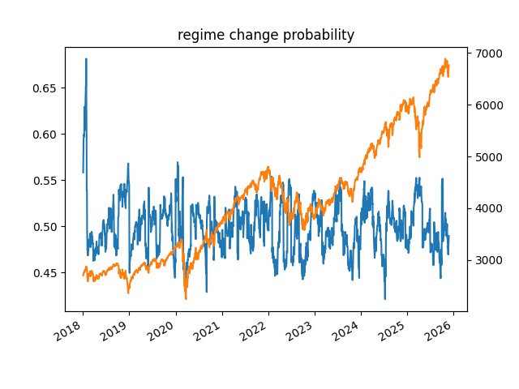

# RegimeChange

This repository implements a **regime-switching investment strategy** inspired by the academic work *Downside Risk Reduction Using Regime-Switching Signals: A Statistical Jump Model Approach* (Shu, Yu & Mulvey, 2024). The goal is to detect “risk regime” periods and reduce downside exposure by switching out of equities when a “dangerous regime” is signaled — thereby improving risk-adjusted returns and downside protection.

## 📄 Reference Paper

- **Title**: Downside Risk Reduction Using Regime-Switching Signals: A Statistical Jump Model Approach  
- **Authors**: Yizhan Shu, Chenyu Yu, John M. Mulvey
- **Journal**: Journal of Asset Management, Vol. 25, Issue 5 (2024), pp. 493–507  
- **Abstract (summary)**: The paper investigates the use of a *statistical jump model (JM)* for market-regime identification, a methodology that differs from traditional hidden Markov models by applying a “jump penalty” to discourage frequent regime switches, thereby improving regime persistence. The model uses only return-series based features (risk and return measures), selects the optimal jump penalty via time-series cross-validation directly optimizing strategy performance, and demonstrates that JM-guided strategies outperform both HMM-based strategies and simple buy-and-hold in terms of lower volatility, smaller maximum drawdown, and higher risk-adjusted returns (e.g. Sharpe ratio), over equity indices in the U.S., Germany, and Japan between 1990–2023 — even accounting for transaction costs and trading delays.

## 🧑‍💻 This Implementation

This code adapts the concept from the paper into a Python backtest framework for the US equity market (S&P 500), combining public data fetch (via yfinance / FRED) with custom regime detection and signaling logic.

### Key Components

- **Data input**:
  - Daily closing price of S&P 500 index (via `yfinance`)  
  - Risk-free rate: 3-month T-bill yield (via FRED)  
  - Term spread: 2-year vs 10-year Treasury yields (via FRED)  

- **Feature construction**:
  - Excess return (SPX return minus risk-free)  
  - Downside deviation (EWMA)  
  - Sortino ratios (with different halflife windows)  
  - Volatility (EWMA standard deviation)  
  - Term-spread  

- **Regime detection and signal generation**:
  - Rolling monthly re-estimation using a user-configurable **jump-penalty-based distance method** (e.g. Huber distance)  
  - Soft cluster probabilities rather than hard assignments (i.e., regime probabilities)  
  - “Sell / risk-off” signal defined as high probability of the “state_0” (assumed to correspond to risk regime)  

- **Backtest visualization**:
  - Plot of regime risk probability over time  
  - Overlay with SPX index price to visually inspect regime-based timing vs market price  

### Why This Is Meaningful

- Implements the core idea of the reference paper in a simple, transparent, and minimal setup.  
- By using only return-series derived features and a penalty-based regime persistence mechanism, this is a lightweight but effective method to explore regime-based timing strategies.  
- Serves as a useful baseline / proof-of-concept — can be extended with additional features (volatility indices, macro data, alternative assets), more regimes, different horizon, portfolio allocation logic, etc.

## 🚀 How to Use

1. Clone the repository.  
2. Install dependencies (e.g. `yfinance`, `pandas`, `pandas_datareader`, `matplotlib`, `numpy`).  
3. Run the main script:

 ```bash
 python main.py
```

This will fetch necessary data, compute features, run rolling regime estimation, and output a plot showing regime-based “sell / risk-off” signal probability vs S&P 500 index price.

### Example



The blue line in the plot represents the predicted probability of **State 0 (risk regime)** generated by the jump-model–based regime switching algorithm.

## Adjust parameters in the script

- **TRAIN_YEARS**: length of the rolling training window (default: 10)  
- **PREDICT_MONTH**: prediction horizon (default: 1 month)  
- **JUMP_PENALTY**: penalty parameter for regime changes (default: 0.2)  
- **NUM_OF_STATES**: number of regimes (default: 2)  
- **DIST_METHOD**: distance / divergence method for clustering (e.g., `'huber'`)  

## Extend / modify for custom analyses

- Add more features (volatility indexes, macro variables, credit spreads, yield curve, etc.)  
- Implement portfolio allocation logic based on regime signal (e.g., reduce equity exposure when risk-off)  
- Backtest with transaction costs, slippage, different frequencies, multiple assets  

## 🔧 Requirements

- Python 3.8
- yfinance  
- pandas, numpy  
- pandas_datareader  
- matplotlib  

## 📚 References & Further Reading

- Shu, Y., Yu, C., & Mulvey, J. M. (2024). *Downside Risk Reduction Using Regime-Switching Signals: A Statistical Jump Model Approach*. Journal of Asset Management.  
- Official Python implementation of statistical Jump Models: **jump-models** by the authors.  

## ⚠️ Caveats / Limitations

- This implementation is not a full portfolio-optimization framework — it only generates a “sell / risk-off signal”.  
- As with any historically calibrated regime model, it is subject to overfitting.  
- Real-world frictions (transaction costs, slippage, liquidity, delays) are not fully modeled.  

## 📝 License & Contributions

Feel free to fork & modify.  
If you improve the model (e.g., add more features, extend to multi-asset portfolios, integrate transaction cost / slippage, optimize parameters), pull requests are welcome.

Thanks for checking out this repo.  
I hope this implementation serves as a useful starting point for regime-based risk control and portfolio timing analyses.